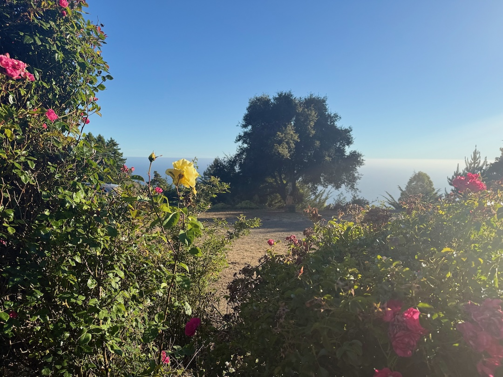

# Shena's Day
*(all activities done with the assistance of my caretaker , who is also my fiancé, unless otherwise specified)*)
### **Morning**
#### 1. The Beginning
- wake up and take medication
- intermittent catheter
- evaluate weather and discuss plans
#### 2. Getting Dressed
- wrap abdominal binders- *allowing me to sit upright, aiding in breathing and voice projection, as well as blood pressure*
- check skin for signs of bruising, swelling, indentation, rash or other unknown injuries
- get dressed and put on boots
#### 3. Transferring
- sit up in bed and move to the edge
- place slideboard under butt and slide to chair
- adjust positioning 
### **& Then ..**
#### 4. Have Coffee (sometimes breakfast)
*(following activities done without assistance)*
#### 5. Water the Garden
#### 6. Check Email/CANVAS 
### **Afternoon**

#### 1. Work on Schoolwork
- >CIT-28
- >CIT 82
- >ENGLISH-C100
 
  View from my Garden in Big Sur

